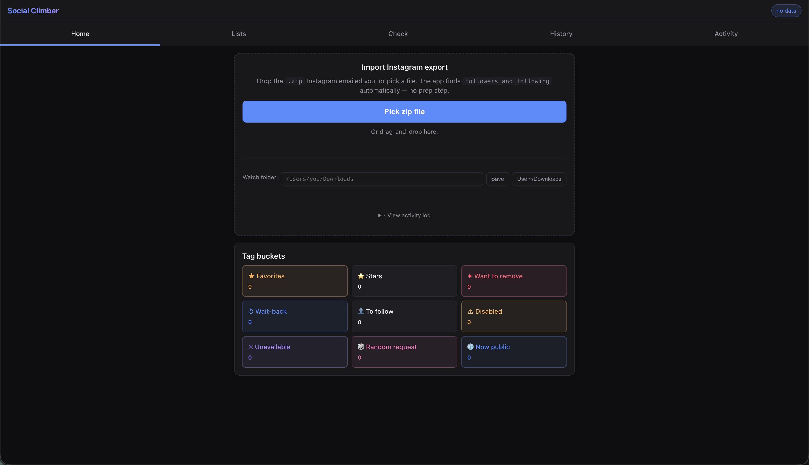
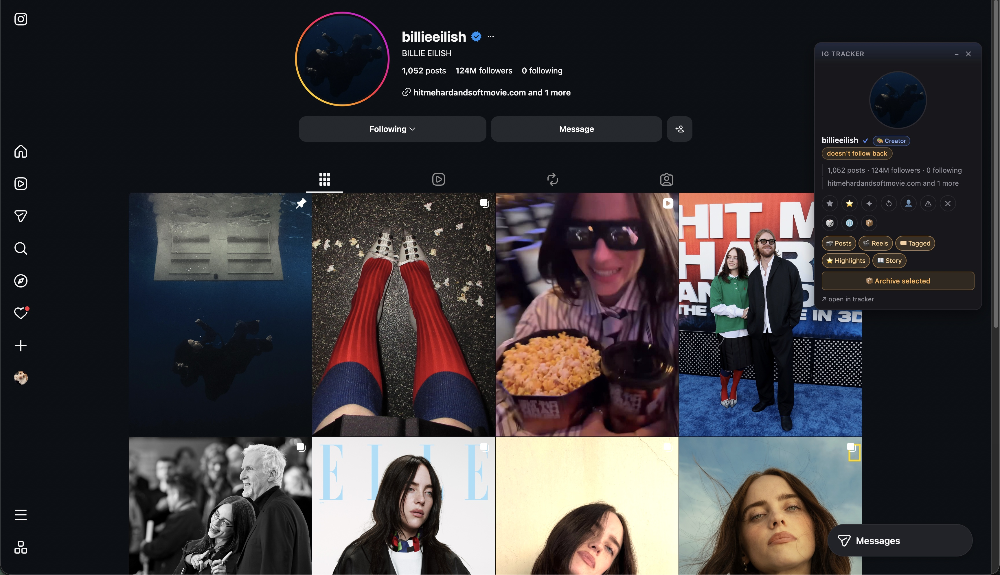

# Social Climber

**Personal-scale Instagram analytics. Local-first. Zero third parties.**



A self-hosted analytics platform for your own Instagram account that turns Meta's static data exports into a queryable timeline. Stack: Python (FastAPI + SQLite), vanilla JavaScript single-page UI, and a Manifest V3 Chrome extension that automates the export workflow and overlays history onto live profile pages.

Built to answer questions Instagram's UI deliberately doesn't:
- Who unfollowed you, and when?
- Who quietly removed you as a follower (the silent kick)?
- Which of your follow requests turned into mutuals, and how long did each take?
- Of every account you've ever followed, who's still around — and who renamed, deactivated, or disappeared?

Every byte stays on your machine.

---

## At a glance

| | |
|---|---|
| **Backend** | Python 3.11 · FastAPI · SQLite (WAL mode) · ~5,000 LOC |
| **Frontend** | Vanilla JS single-page app · hand-rolled SVG charts · no build step · PWA-installable |
| **Extension** | Chrome Manifest V3 · service worker · MAIN-world content scripts · `chrome.debugger` for trusted-click automation |
| **Data model** | Append-only snapshots + derived materialized views · content-hash dedup · idempotent migrations |
| **Caching** | SWR (stale-while-revalidate) pattern with version-tracked invalidation across snapshot+tag mutations |
| **Privacy** | Local-only — server binds to LAN, no outbound requests, optional self-signed HTTPS for phone access |

---

## Why

Instagram's "Activity" tab only shows you a few weeks of changes and never tells you who removed you as a follower. The data is all in the official export — but each export is a frozen snapshot, with no way to track change.

This is what falls out when you persist every export and let the diffs do the talking:
- A canonical list of every account that ever unfollowed you, with renames and deactivations filtered out so the count actually means something
- The exact moment each follow / unfollow / mutual happened, pulled from Instagram's per-row timestamps
- A live activity log of who came, who went, and who quietly removed you between snapshots
- A cumulative "everyone you've ever interacted with" view that doesn't get reset by Instagram's 30-day rolling windows

Drop in the export zip; it does the rest.

---

## Features

### Ingestion & data engineering
- **One-step import** — drop the `.zip` Meta emails you onto the home screen, or point it at the pre-extracted folder Meta uploads to Google Drive. JSON files are discovered at any nesting depth.
- **Auto-import via Drive watcher** — point `IG_WATCH_FOLDER` at your synced Drive directory and new exports become snapshots automatically. Detects both `.zip` deliveries and the `meta-YYYY-MMM-DD/` folders Meta uses for Drive delivery.
- **Chronological insertion** — snapshots are ordered by the export's actual generation timestamp, not import order. Drop in a six-month-old export tomorrow and it slots into the right place on the timeline without breaking diffs.
- **Duplicate-safe with backfill** — content-hash on every snapshot means re-importing is a no-op, but a newer schema version re-fills columns that didn't exist when the snapshot was first imported.
- **Schema migrations** — `db.py` runs idempotent ALTER TABLE migrations on every boot. No external tooling required.

### Analytics

Cumulative analyses across all snapshots:
- **Ever-unfollowed** — every account that ever dropped you, with rename and IG-export-quirk noise filtered out
- **Silent kicks** — every account that ever removed you as a follower
- **One-sided mutuals** — accounts you still follow despite them dropping you
- **Reciprocity gaps** — for every mutual, how long it took them to follow back (instant / fast / slow / late buckets)
- **Funnel metrics** — incoming requests → accepted → followed back, and outgoing the reverse direction

Per-account intelligence:
- Username-rename detection using shared Instagram-side timestamps; aliases are clickable inside the per-account modal
- Per-account journey view — every snapshot's relationship status (mutual, not-following-back, recent-unfollow, etc.)
- Distinct on/off/on follow runs per account
- Heuristic privacy inference (private vs likely-public) per account, derived from extension-bridged page observations

### Visualization
- **Timeline chart** — multi-series SVG line chart of followers / following / mutuals / pending / unfollowers over time, with hover tooltips, drag-to-zoom, and per-snapshot drill-down on tap. Hand-rolled SVG, no charting library.
- **Activity log** — every individual change event with precise IG timestamps, per-kind filters, per-day event counts, virtualized scrolling for thousands of events
- **Sparklines** — 30-day inline trend visualizations on aggregate stat tiles

### Tagging & curation
- ★ Favorites — high-severity alert when they unfollow you
- ⭐ Stars — separate bucket for creators/celebs vs everyday acquaintances
- ✦ Want to remove — plan-to-unfollow list
- ↺ Wait-back — auto-alerts when a tagged account hasn't followed back in 7 days
- 👤 To follow — bookmark accounts to visit later; auto-clears when the relationship resolves
- ⚠ Disabled / ✕ Unavailable — flag dead accounts; auto-clear on reactivation
- 📝 Notes — free-text per-account; persists across unfollows
- Bulk note editor with multi-select

### Smart alerts
Diff- and state-based:
- New unfollows, silent kicks, accepted-then-no-followback, request rejections
- ★ Favorites get high-severity treatment
- Stateful overdue alerts (waitlist hasn't followed back, incoming request unanswered for N days)
- Partial-export detection — IG's exports occasionally truncate, alerts suppress themselves when a snapshot looks incomplete to avoid 1000-alert avalanches
- Acknowledge / "mark read" to clear new-flag noise

### Companion Chrome extension (Manifest V3)



- **Profile overlay** — when you visit any IG profile, an overlay panel surfaces this account's history from the tracker (mutual since X, ever-unfollowed-you flag, current tags, notes)
- **Live page-state bridging** — content script reads the actual "Follow / Following / Requested" button state per profile and writes it to `profile_observations`. Closes the ~25-minute gap between IG exports so the home stats reflect "what you actually see in the app right now."
- **Export wizard automation** — auto-fills Meta's data export wizard (JSON, followers+following, all-time, Google Drive) with your saved preferences. Survives the SPA's screen-switching dance, dispatches trusted clicks via `chrome.debugger`, handles the password challenge and the Google OAuth chooser.
- **Scheduled exports** — set min/max interval and the SW alarm fires a fresh export at a jittered time inside the window (so the pattern doesn't look robotic to Instagram).
- **Arrival-poll telemetry** — measures how long Meta takes to deliver each export to Drive; uses the historical distribution to start polling just before the typical arrival.
- **Push-on-failure** — server-side hook calls `~/.config/social-climber/push.json` configurable command (default: iMessage to your own phone number) when 2+ consecutive exports fail.

### Privacy & operational hygiene
- Local-only — server binds to your LAN, no outbound calls
- Optional self-signed HTTPS (covering `localhost` + LAN IP) for iOS Clipboard API access from your phone
- macOS keep-awake helper for long-running automation (`caffeinate`, `pmset disablesleep`)
- Audit log table tracks every snapshot-bump / reset / delete event
- Soft delete + recovery for snapshots

---

## Architecture

```
                                          ┌────────────────────────────────┐
                                          │ instagram.com (your browser)   │
       ┌──────────────────┐               │ ┌────────────────────────────┐ │
       │ Meta Data Export │───[email]──>  │ │ Extension content scripts  │ │
       │ wizard           │               │ │ • profile overlay          │ │
       └──────┬───────────┘               │ │ • page-state interceptor   │ │
              │                           │ │ • export-wizard autopilot  │ │
              │ .zip                      │ └────────────┬───────────────┘ │
              ▼                           │              │ chrome.runtime  │
       ┌──────────────────┐               │              ▼                 │
       │ Google Drive     │               │ ┌────────────────────────────┐ │
       │ (Meta uploads)   │               │ │ MV3 service worker         │ │
       └──────┬───────────┘               │ │ • alarm-driven scheduling  │ │
              │                           │ │ • chrome.debugger clicks   │ │
              │ filesystem sync           │ │ • cross-tab orchestration  │ │
              ▼                           │ └────────────┬───────────────┘ │
       ┌────────────────────────┐         └──────────────┼─────────────────┘
       │ Drive desktop folder   │                        │
       └──────┬─────────────────┘                        │ HTTP POST
              │ polled by watcher.py                     │ /api/profile-pic
              │                                          │ /api/profile-bytes
              ▼                                          │
   ┌──────────────────────────────────────┐              │
   │ FastAPI (localhost:8000)             │<─────────────┘
   │ ──────────────────────────────────── │
   │ ingest.py    snapshot ingest         │
   │ queries.py   derived analytics       │
   │ diffs.py     snapshot-pair diffs     │
   │ alerts.py    home-screen alert gen   │
   │ tags.py      five-bucket curation    │
   │ followup.py  persistent queue        │
   └──────────────┬───────────────────────┘
                  │ SWR-cached reads
                  ▼
   ┌──────────────────────────────────────┐
   │ SQLite (WAL, busy_timeout=5s)        │
   │ ──────────────────────────────────── │
   │ snapshots, followers, following,     │
   │ pending_follow_requests,             │
   │ incoming_follow_requests,            │
   │ profile_tags, profile_observations,  │
   │ audit_log, follow_queue              │
   └──────────────────────────────────────┘
```

---

## Project layout

```
instagram_tracker/
├── server.py             FastAPI HTTP API (~40 endpoints)
├── ingest.py             Zip/folder import with auto-discovery, dedup, backfill
├── watcher.py            Polling folder watcher for Drive auto-import
├── queries.py            Read-side queries · rename + reengagement detection · privacy inference
├── diffs.py              Snapshot diff math (pure functions, fully unit-testable)
├── alerts.py             Diff- and state-based home-screen alert engine
├── tags.py               Five tag buckets w/ auto-clear logic
├── followup.py           Persistent follow queue
├── filtering.py          Bulk seen-vs-new analyzer
├── parsers.py            Instagram JSON parsing
├── routes_followup.py    Followup endpoints (extracted route module)
├── routes_profiles.py    Profile pic + bio endpoints (extracted route module)
├── db.py                 SQLite schema · idempotent migrations · content-hash helpers
├── deps.py               Shared connection context manager
└── static/               Mobile-first single-page UI (vanilla JS, hand-rolled SVG charts)

extension/chrome/
├── manifest.json         MV3
├── background.js         Service worker — scheduling, debugger orchestration, msg routing
├── popup.html / .js / .css   Settings + scheduling UI
└── content/
    ├── ig-profile.js     Profile overlay + page-state observer
    ├── meta-export.js    Export wizard autopilot
    └── google-oauth.js   OAuth account picker auto-select
```

---

## Running locally

Requires Python 3.10+ (3.11 recommended). On first run, dependencies install into a local `.venv` automatically.

```bash
./run.sh
```

The launcher prints two URLs:
- `http://localhost:8000` — open on the same machine
- `http://<your-lan-ip>:8000` — open in Safari on your phone (same Wi-Fi)

Stop with `Ctrl-C`. Your local database lives at `data/instagram_tracker.db`.

### Drive auto-import

If your Instagram exports go to Google Drive (Meta's "Send to Google Drive" delivery option) and you have Drive desktop installed, set `IG_WATCH_FOLDER` to your Drive's My Drive path and the home page gets a "Scan Drive folder" button. Already-imported exports are skipped via a `source_path` cache.

```bash
IG_WATCH_FOLDER="$HOME/Library/CloudStorage/GoogleDrive-you@example.com/My Drive" ./run.sh
```

For background polling, also set `IG_WATCH_POLL=1` (default 60s interval; override with `IG_WATCH_INTERVAL_S`).

### Optional: HTTPS with a self-signed cert

iOS Safari blocks the Clipboard API on `http://<lan-ip>` origins. If you want clipboard paste from your phone, run the server over HTTPS using a cert you generate yourself. **Nothing leaves your LAN.**

```bash
./scripts/make-cert.sh    # one-time, ~5 minutes
IG_HTTPS=1 ./run.sh
```

The cert covers `localhost`, `127.0.0.1`, and your Mac's current LAN IP. Trust it on your iPhone via Settings → General → VPN & Device Management → Certificate Trust Settings.

### Chrome extension (optional)

Load `extension/chrome/` as an unpacked extension at `chrome://extensions`. Set the **Tracker URL** in the popup to your server's address (defaults to `http://127.0.0.1:8000`). The Meta export wizard autopilot and the profile overlay activate immediately.

---

## Privacy

Surface area for your data:
- `data/instagram_tracker.db` — local SQLite file, never transmitted
- A FastAPI server bound to `0.0.0.0:8000` so your phone on the same Wi-Fi can reach it
- The frontend is plain HTML/CSS/JS served from disk; it makes no third-party requests
- The browser extension talks to **two** origins only: this server (localhost) and `instagram.com` pages you're already on

`data/`, `.venv/`, and other local artifacts are gitignored. Even if this repository is shared, none of your history is included.

---

## Tech notes worth pointing out

- **SQL-first analytics.** The interesting work happens in `queries.py` — set operations on follower/following snapshots, plus per-username chronological queries for "when did X last appear in [followers / following / pending]." Bulk lookups use `IN (...)` with batched chunking; per-snapshot derived sets are materialized via a `_per_user_sid_chrono` helper.
- **SWR with version invalidation.** The heavy `/api/home`, `/api/lists`, `/api/activity-log`, and `/api/timeline` endpoints stash their last result in an in-process LRU keyed on `(snapshot_version, tag_version)`. Reads return the cached payload immediately and trigger a background recompute if the version has bumped. A first uncached request blocks, subsequent ones see no latency.
- **Snapshot-pair diffing.** `diffs.py` is the boring file you wish more codebases had: a small library of pure set-difference functions that turn "snapshot N → snapshot N+1" into typed event records (joined, parted, accepted, rejected, removed_you, withdrew, etc.). Every diff alert and every activity-log row is a row produced by this library.
- **Extension-side state bridging.** Instagram's export lags reality by ~25 minutes. The MV3 content script reads the actual "Follow / Requested / Following" button label every time you visit a profile and writes it to a `profile_observations` table. The home page's "Following: 2117" then = `(latest export's following set) − (your tagged-as-disabled/random) ∪ (extension-observed 'Following' newer than the export's taken_at)`, a freshness gate that prevents stale observations from inflating the count after you've unfollowed.
- **Manifest V3 service worker scheduling.** `chrome.alarms` survives SW idle eviction; pure `setTimeout` does not. The export scheduler uses jittered `delayInMinutes` alarms; the per-run "arrival poll" uses a separate alarm so the SW can wake up minutes later to check Drive for delivery.
- **`chrome.debugger` for trusted clicks.** Meta's React handlers gate critical destination-chooser clicks on `isTrusted=true`. The SW attaches the debugger and dispatches `Input.synthesizeTapGesture`, which Chrome's input layer treats as a real touch — slips past the gate.

---

## What this project exercises

A non-exhaustive list of the disciplines this project actually does work in (as opposed to merely touching):

- **Backend & API design** — FastAPI with ~40 endpoints, SWR caching with version-tracked invalidation, idempotent migrations, content-hash dedup, soft-delete + recovery, audit logging.
- **Data engineering** — append-only snapshot ingestion, chronological-by-export-timestamp insertion, partial-export detection, schema-version backfill, bulk-discovery from nested zip / folder trees.
- **Data analytics** — set-difference math over follower / following / pending / incoming snapshots; rename detection via shared IG-side timestamps; cumulative cross-snapshot views; reciprocity-gap bucketing.
- **SQL** — heavy use of CTEs, window-like analytics over snapshot pairs, bulk `IN`-batching for per-username chronologies, careful index design to keep cold-cache compute under 30s on 50k+ row snapshot tables.
- **Frontend / UX** — vanilla-JS single-page app, hand-rolled SVG timeline chart with drag-to-zoom and hover tooltips, virtualized activity log, PWA-installable, mobile-first.
- **Browser extension engineering** — Manifest V3 service worker with alarm-driven scheduling, content scripts that survive Instagram's SPA navigations, `chrome.debugger` for trusted-click automation, cross-context message routing.
- **Automation & operations** — jittered scheduling, push-on-failure to a configurable command, history-derived arrival-poll windows, macOS launchd helpers, soft-fail retry strategy.
- **Privacy engineering** — strictly local data path, optional self-signed HTTPS for LAN access, no third-party requests, auditable surface area.
- **Product thinking** — alerts that suppress themselves on partial exports, freshness gates that prevent stale extension observations from inflating counts, "no decay without positive evidence" rule baked into the diff engine.

---

## License

MIT — see [LICENSE](./LICENSE).
